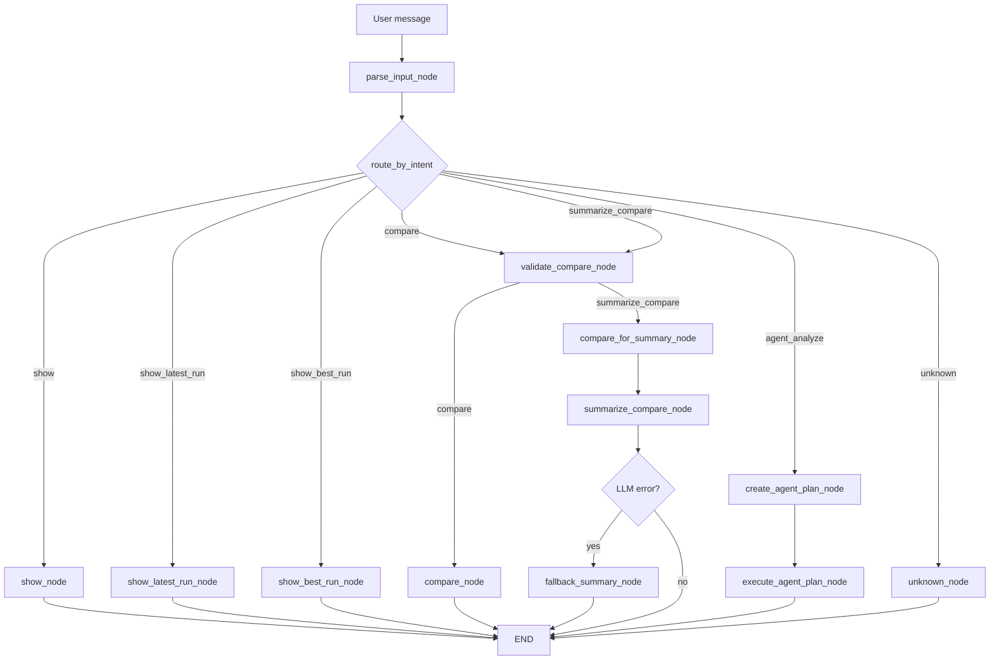

# MLLabAgent

MLLabAgent is a FastAPI + LangGraph assistant for analyzing MLflow experiment runs through natural language requests.

The project combines MLflow experiment tracking, deterministic ML experiment analysis, and LLM-powered workflow orchestration. It is designed as a small ML engineering / agentic AI project focused on experiment inspection, comparison, and summarization.

## Features

MLLabAgent can:

- show runs from MLflow
- show a specific run by ID, prefix, or run name
- show the latest run
- show the best run by selected metric
- compare two runs
- compare both metrics and parameters
- summarize experiment differences using an LLM
- fall back to a deterministic summary if the LLM fails
- execute an agentic analysis workflow using LLM planning and deterministic tool execution

## Requirements

- Python 3.11 or 3.12
- uv
- MLflow
- Gemini API key for LLM-based features

## Setup

Install dependencies:

```bash
uv sync
```

Optional: activate the created virtual environment manually.

```bash
source .venv/bin/activate
```

## Environment Variables

Use `.env.example` as a template:

```bash
cp .env.example .env
```

Example `.env`:

```env
GEMINI_API_KEY=your_api_key_here
GEMINI_MODEL=gemini-2.5-flash-lite
MLFLOW_TRACKING_URI=http://127.0.0.1:8080
MLFLOW_EXPERIMENT_NAME=MLLabAgent Demo Runs
```

You can also temporarily configure the Gemini API key in the current terminal session:

```bash
export GEMINI_API_KEY="your_api_key_here"
```

This works only in the current shell session.

## Run Application

Recommended:

```bash
uv run python -m uvicorn --app-dir src ml_lab_agent.main:app --host 127.0.0.1 --port 8000 --env-file .env
```

For local development with auto-reload:

```bash
uv run python -m uvicorn --app-dir src ml_lab_agent.main:app --host 127.0.0.1 --port 8000 --env-file .env --reload
```

Open API docs:

```text
http://127.0.0.1:8000/docs
```

## MLflow Demo Runs

Use two terminals.

1. Start MLflow tracking server on port 8080:

```bash
uv run mlflow server --backend-store-uri sqlite:///mlflow.db --default-artifact-root ./mlruns --host 127.0.0.1 --port 8080
```

2. In another terminal, create demo runs in experiment `MLLabAgent Demo Runs`:

```bash
uv run python src/scripts/create_demo_runs.py --tracking-uri http://127.0.0.1:8080 --experiment-name "MLLabAgent Demo Runs"
```

3. Open MLflow UI:

```text
http://127.0.0.1:8080
```

## Supported Chat Requests

The assistant accepts natural language requests about ML experiments. Examples:

- show run baseline_lr
- show latest run
- show best run by accuracy
- show best run by f1_score
- compare run baseline_lr and run tuned_cnn
- compare latest run and best run by f1_score
- summarize comparison of baseline_lr and tuned_cnn
- analyze latest experiment
- analyze latest experiment and recommend next step

## Architecture

High-level flow:

```text
FastAPI -> LangGraph -> Services -> Repositories -> MLflow
```

- FastAPI exposes the `/chat` endpoint.
- LangGraph orchestrates the workflow, routing, validation, fallback paths, and agentic analysis flow.
- Services contain business logic such as run comparison, best-run selection, latest-run selection, identifier resolution, and LLM summary generation.
- Repositories read experiment data from MLflow and map MLflow run objects into application-level dictionaries.
- LLM services parse natural language requests, generate experiment summaries, and create structured agent plans.
- The agentic workflow separates LLM-based planning from deterministic tool execution.

## Chat Workflow



## Agentic Workflow

For more complex requests, MLLabAgent uses an agentic planning workflow:

1. The LLM planner converts the user request into a structured tool plan.
2. The deterministic executor runs only allowed tools.
3. The final response combines retrieved runs, comparisons, summaries, and recommendations.

Example request:

```text
analyze latest experiment and recommend next step
```

This can trigger a multi-step flow such as:

```text
get latest run -> get best run by metric -> compare runs -> generate summary
```

## Testing

Run tests excluding integration tests:

```bash
uv run pytest -m "not integration"
```

Run all tests:

```bash
uv run pytest
```

Run code checks:

```bash
uv run ruff check .
uv run ruff format .
```

Integration tests may require a valid Gemini API key and access to the configured MLflow tracking server.

## Stop Running App

If running in foreground terminal, press:

```text
Ctrl+C
```

If running in background or from another terminal:

```bash
pkill -f "uvicorn.*ml_lab_agent.main:app"
```

If port is still occupied, find and kill by PID:

```bash
lsof -nP -iTCP:8000 -sTCP:LISTEN
kill <PID>
```
