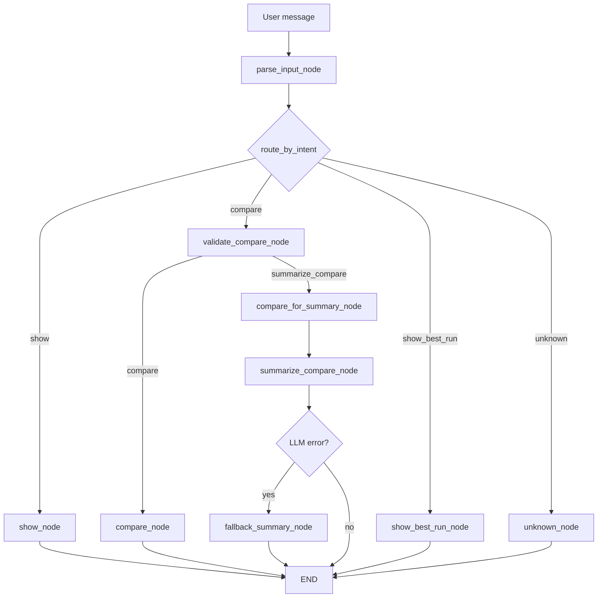

# Architecture

```mermaid
flowchart TD
    A[User message] --> B[parse_input_node]
    B --> C{route_by_intent}

    C -->|show| D[show_node]
    C -->|compare| E[validate_compare_node]
    C -->|show_best_run| F[show_best_run_node]
    C -->|unknown| G[unknown_node]

    E -->|compare| H[compare_node]
    E -->|summarize_compare| I[compare_for_summary_node]

    I --> J[summarize_compare_node]
    J --> K{LLM error?}
    K -->|yes| L[fallback_summary_node]
    K -->|no| M[END]

    D --> M
    F --> M
    G --> M
    H --> M
    L --> M
```