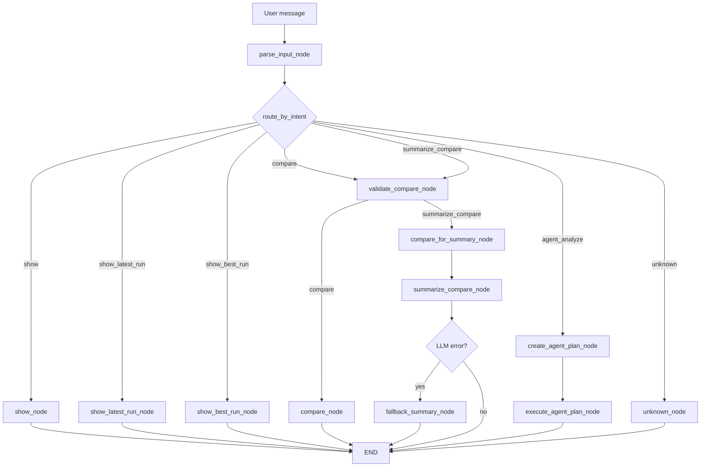

# Architecture

```mermaid
flowchart TD
    A[User message] --> B[parse_input_node]
    B --> C{route_by_intent}

    C -->|show| D[show_node]
    C -->|show_latest_run| E[show_latest_run_node]
    C -->|show_best_run| F[show_best_run_node]
    C -->|compare| G[validate_compare_node]
    C -->|summarize_compare| G
    C -->|agent_analyze| H[create_agent_plan_node]
    C -->|unknown| I[unknown_node]

    G -->|compare| J[compare_node]
    G -->|summarize_compare| K[compare_for_summary_node]
    K --> L[summarize_compare_node]
    L --> M{LLM error?}
    M -->|yes| N[fallback_summary_node]
    M -->|no| O[END]

    H --> P[execute_agent_plan_node]

    D --> O
    E --> O
    F --> O
    I --> O
    J --> O
    N --> O
    P --> O
```